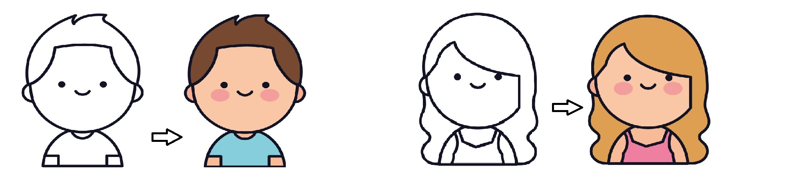
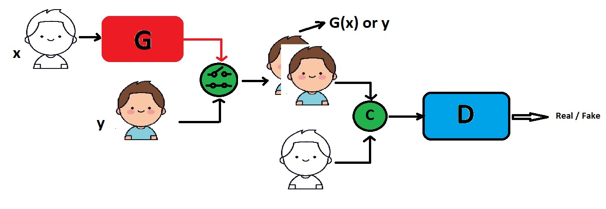
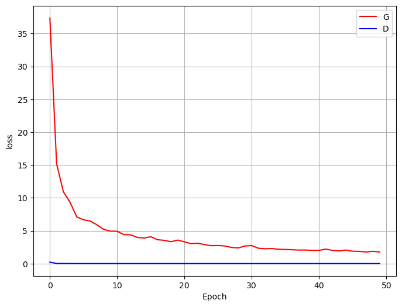
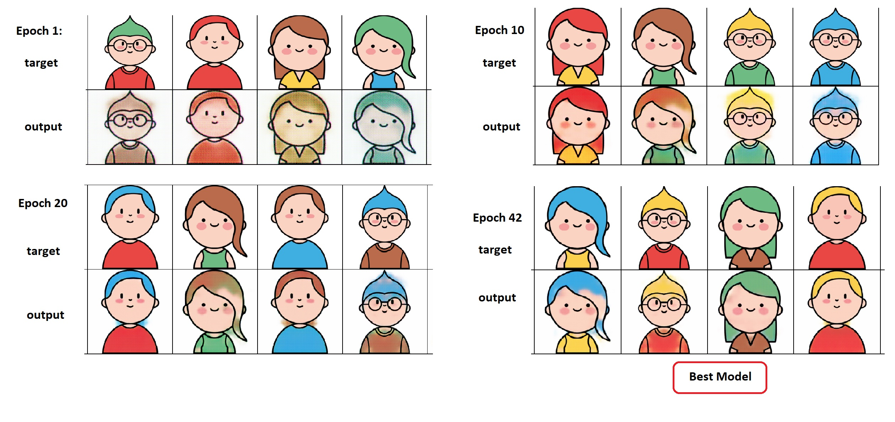

    
<h1 align="center"> Image Coloring</h1>

  

## 1. Problem Statement
Image coloring using Generative Adversarial Networks (GANs) is a technique where a GAN architecture is employed to add color to grayscale images. GANs consist of two neural networks, a generator and a discriminator, which are trained together in a competitive setting. The generator network takes a grayscale image as input and tries to generate a colored version of it. The goal of the generator is to produce images that are as realistic as possible. The discriminator network takes an image (either real colored image or the generated colored image) and tries to distinguish between the real and the generated images. The discriminator's goal is to correctly classify the images as real or fake.

## 3. The Proposed Method
A Conditional GAN-Based architecture is used in this task for solving the problem. We add a condition to the inputs of Generator and Discriminator.

### Overview of GAN Architecture
  
Generator: The generator network takes a grayscale image as input and tries to generate a colored version of it. The goal of the generator is to produce images that are as realistic as possible.

Discriminator: The discriminator network takes an image (either real colored image or the generated colored image) and tries to distinguish between the real and the generated images. The discriminator's goal is to correctly classify the images as real or fake.

    
<h3 align="center"> proposed method architecture</h3>

The generator and discriminator networks are initialized with random weights. The discriminator is trained on a batch of real colored images and a batch of generated colored images (produced by the generator from grayscale inputs). The discriminator updates its weights to improve its ability to distinguish between real and fake images. 

The generator takes a batch of grayscale images concatenated with the conditions( embedings of hair and shirt color) and generates colored versions. These generated images and target images are concatenated with a colorless sketch of target image and then at each moment, one of these combinations is concatenated with the conditions again and is fed into the discriminator. The generator updates its weights based on the discriminator's feedback, aiming to produce more realistic colored images that can fool the discriminator.

## 4. Implementation
This section delves into the practical aspects of the project's implementation.

### 4.1. Dataset
Dataset contains 10 colorless human character icons as input. Every input image has 25 identical sample of colored with different patterns. 

Metadata.csv involves information about every input and output image. 
- **input:** name of input image
- **output:** name of output image
- **hair:** indicates the color of hair
- **shirt:** indicates the color of shirt

hair and shirt colors are converted to one-hot encoding and are concatenated with the input image to feed into Generator and Discriminator.
### 4.2. Model
This subsection, is presenting the architecture and specific components of model. 

- Generator

        class Generator(nn.Module):
          def __init__(self, in_channels=13):
            super().__init__()
            # Encoder
            nc = [in_channels, 64, 128, 256, 512, 512, 512, 512, 512]
            self.encoders = nn.ModuleList([   EncoderBlock(nc[i-1], nc[i], batchnorm=False if i==1 else True) for i in range(1, len(nc)) ])
            # Decoder
            nc.reverse()
            self.decoders = nn.ModuleList([ DecoderBlock(2*nc[i-1] if i>1 else nc[i-1], nc[i], dropout=True if i<4 else False) for i in range(1, len(nc[:-1])) ])
            self.last = nn.ConvTranspose2d(128, 3, kernel_size=4, stride=2, padding=1)
            self.tanh = nn.Tanh()

- Discriminator
  
      class Discriminator(nn.Module):
          def __init__(self, in_channels=16):
            super().__init__()
            nc = [in_channels, 64, 128, 256]
            self.layers = nn.ModuleList([ EncoderBlock(nc[i-1], nc[i], batchnorm=True if i>1 else False) for i in range(1, len(nc))  ])
        
            self.layers += nn.Sequential(
                nn.ZeroPad2d(padding=1),
                nn.Conv2d(256, 512, kernel_size=4, bias=False),
                nn.BatchNorm2d(512),
                nn.LeakyReLU(0.2))
        
            self.layers += nn.Sequential(
                nn.ZeroPad2d(1),
                nn.Conv2d(512, 1, kernel_size=4)
            )

        
### 4.3. Configurations
This part demostrates the costumized loss configuration used for training and optimization of the entier model. It includes information on optimization algorithms, loss function, metric, and any other settings that are crucial to the model's performance.

    
<h3 align="center"> Train architecture of Generator</h3>

    
<h3 align="center"> Train architecture of Discriminator</h3>

-**Metric:**  optim.Adam(generator.parameters(), lr=2e-4, betas=(0.5, 0.999)) , optim.Adam(discriminator.parameters(), lr=2e-4, betas=(0.5, 0.999))

### 4.4. Train
The model trained for 50 epochs with lr = 0.0002. Best Generator's train loss obtained 2.44 in epoch=48. Best validation loss was 0.01685 in epoch=37. The learning curve for Generator and Discriminator is as below.

    

### 4.5. Evaluate
Result images in different epochs.

    

